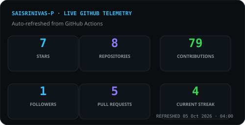
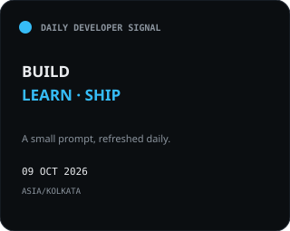
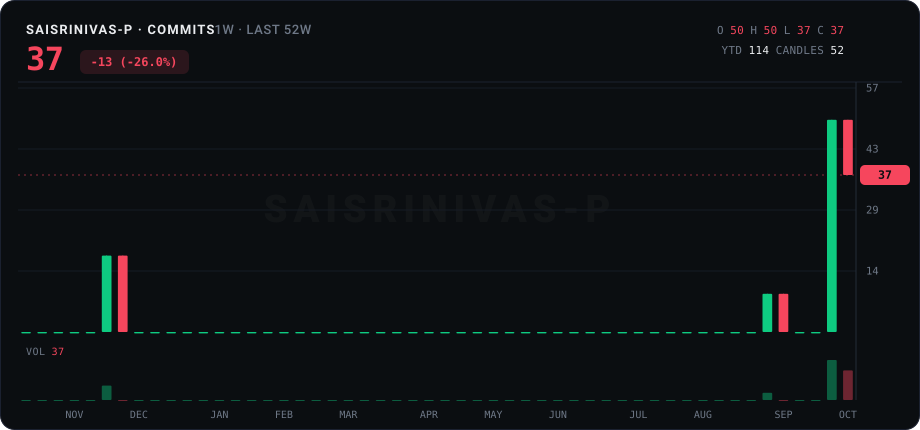
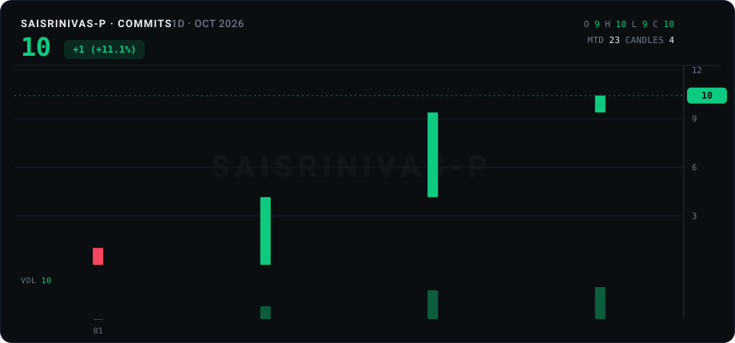

<strong>⚡ Building real projects · 🧠 AI/ML · 🛠️ Full-Stack · ☁️ Backend & Cloud</strong>

<table align="center">
<tr>
<td align="center"> <b>LinkedIn</b></td>
<td width="18"></td>
<td align="center"> <b>GitHub</b></td>
<td width="18"></td>
<td align="center"> <b>Gmail</b></td>
<td width="18"></td>
<td align="center"> <b>GeeksforGeeks</b></td>
<td width="18"></td>
<td align="center"> <b>LeetCode</b></td>
<td width="18"></td>
<td align="center"> <b>HackerRank</b></td>
</tr>
</table>

<h3 align="center">Full-Stack Developer · Backend Engineer · AI/ML Builder</h3>

---

# 📊 Live GitHub Dashboard

  <b>Live stats · contribution activity · daily developer signal</b>

<table align="center" width="100%">
<tr>
<td width="62%" align="center" valign="middle">
  
</td>
<td width="38%" align="center" valign="middle">
  
</td>
</tr>
</table>

### 🐍 Contribution Snake

Contribution activity, rendered as a moving code trail.

  

### 🕯️ Contribution Candles

Year and month activity, visualized as contribution candles.

<table align="center" width="100%">
<tr>
<td width="50%" align="center">
  
</td>
<td width="50%" align="center">
  
</td>
</tr>
</table>

Snake and contribution charts refresh through GitHub Actions · live stats and the daily signal update automatically.

<a href="https://github.com/dahan8473/snake-and-commits">Snake and Commits</a> · <a href="https://github.com/rowkav09/GitHub-profile-stats">GitHub Profile Stats</a> · <a href="https://github.com/starlash7/github-candles">github-candles</a> · <a href="https://github.com/in-c0/daily-badge">Daily Badge</a>

---

# 🧰 Tech Stack

## 01 · Languages

<table>
<tr>
<td align="center"> <b>C</b></td>
<td width="18"></td>
<td align="center"> <b>Java</b></td>
<td width="18"></td>
<td align="center"> <b>C#</b></td>
<td width="18"></td>
<td align="center"> <b>Python</b></td>
</tr>
</table>

## 02 · .NET Ecosystem

<table>
<tr>
<td align="center"> <b>.NET</b></td>
<td width="12"></td>
<td align="center"> <b>.NET Core</b></td>
<td width="12"></td>
<td align="center"> <b>ASP.NET Core</b></td>
<td width="12"></td>
<td align="center"> <b>MVC</b></td>
<td width="12"></td>
<td align="center"> <b>Web API</b></td>
</tr>
<tr>
<td align="center"> <b>ADO.NET</b></td>
<td></td>
<td align="center"> <b>Entity Framework</b></td>
<td></td>
<td align="center"> <b>LINQ</b></td>
</tr>
</table>

## 03 · Web Development

<table>
<tr>
<td align="center"> <b>HTML</b></td>
<td width="15"></td>
<td align="center"> <b>CSS</b></td>
<td width="15"></td>
<td align="center"> <b>Bootstrap</b></td>
<td width="15"></td>
<td align="center"> <b>JavaScript</b></td>
<td width="15"></td>
<td align="center"> <b>jQuery</b></td>
<td width="15"></td>
<td align="center"> <b>React.js</b></td>
</tr>
</table>

## 04 · Other Frameworks & APIs

<table>
<tr>
<td align="center"> <b>Spring Boot</b></td>
<td width="18"></td>
<td align="center"> <b>JUnit</b></td>
<td width="18"></td>
<td align="center"> <b>RESTful APIs</b></td>
</tr>
</table>

## 05 · AI / Machine Learning

<table>
<tr>
<td align="center"> <b>ML.NET</b></td>
<td width="10"></td>
<td align="center"> <b>OpenAI API</b></td>
<td width="10"></td>
<td align="center"> <b>LLMs</b></td>
<td width="10"></td>
<td align="center"> <b>RAG</b></td>
<td width="10"></td>
<td align="center"> <b>Generative AI</b></td>
</tr>
<tr>
<td align="center"> <b>Deep Learning</b></td>
<td></td>
<td align="center"> <b>NLP</b></td>
<td></td>
<td align="center"> <b>CNN</b></td>
<td></td>
<td align="center"> <b>RNN</b></td>
</tr>
</table>

## 06 · Databases

<table>
<tr>
<td align="center"> <b>SQL Server</b></td>
<td width="25"></td>
<td align="center"> <b>MySQL</b></td>
</tr>
</table>

## 07 · Engineering Concepts

## 08 · Tools & Platforms

<table>
<tr>
<td align="center"> <b>Visual Studio</b></td>
<td width="14"></td>
<td align="center"> <b>VS Code</b></td>
<td width="14"></td>
<td align="center"> <b>SSMS</b></td>
<td width="14"></td>
<td align="center"> <b>Eclipse</b></td>
<td width="14"></td>
<td align="center"> <b>Git</b></td>
<td width="14"></td>
<td align="center"> <b>GitHub</b></td>
</tr>
<tr>
<td align="center"> <b>Linux</b></td>
<td></td>
<td align="center"> <b>Azure</b></td>
<td></td>
<td align="center"> <b>GitHub Actions</b></td>
<td></td>
<td align="center"> <b>MS Office</b></td>
</tr>
</table>

## 09 · AI Assistants

<table>
<tr>
<td align="center"> <b>ChatGPT</b></td>
<td width="25"></td>
<td align="center"> <b>Microsoft Copilot</b></td>
<td width="25"></td>
<td align="center"> <b>Gemini</b></td>
<td width="25"></td>
<td align="center"> <b>Claude</b></td>
</tr>
</table>

---

# 🚀 Featured Projects

## 🏥 CARE-MIND — AI Healthcare Platform

**C# · .NET 10 · ASP.NET Core Web API · Entity Framework Core · SQL Server · JWT · OpenAI API · Docker · CI/CD**

A portfolio-grade healthcare management platform built around secure role-based access and AI-assisted workflows.

- 🔐 **3 user roles:** Admin, Doctor, Patient with JWT-secured access
- 🩺 **7+ core capabilities:** patient management, doctor management, appointments, medical records, medications, AI assistance, and AI-powered visit preparation
- 🧱 **3-layer architecture:** API, Domain, Infrastructure
- 🧪 **10+ production-oriented capabilities:** global exception handling, health checks, audit logging, database migrations, automated testing, Docker Compose, and CI integration

🔗 **[Repository →](https://github.com/Sai-Developer-1405/CARE-MIND-AI-HEALTHCARE-PLATFORM)**

---

## 🎓 Student Management System

**C# · .NET Framework · Windows Forms · MySQL**

A desktop application for managing academic records through a structured Windows-based workflow.

- 👨‍🎓 **4 core areas:** student information, course management, registration, and academic performance
- 🧩 **10+ forms/components:** student management, courses, registration, dashboards, printing, and database operations
- 🗄️ **Complete CRUD:** persistent MySQL storage with reusable C# classes for connectivity, student records, course information, and reporting

🔗 **[Repository →](https://github.com/Sai-Developer-1405/STUDENT_MANAGEMENT_SYSTEM)**

---

## 🎓 EduPortfolio Vision Hub

**Spring Boot · Spring Security · Hibernate · MySQL · JSP · JSTL · HTML · CSS · Bootstrap · React · Maven**

A role-based student portfolio platform focused on secure access, project tracking, and faster academic workflows.

- ⚡ **40% faster data access** through backend optimizations
- 🔐 Secure authentication, role-based authorization, CRUD operations, and real-time project progress tracking
- 👩‍🏫 **50% lower faculty manual-review workload** based on the project results reported in the resume
- 🧭 **30% lower navigation time** across key workflows with responsive UI and optional React integration

🔗 **[Repository →](https://github.com/Sai-Developer-1405/EDUPORTFOLIO-VISION-HUB)**

---

## 🚗 Automotive Anomaly Detection System

**Python · Scikit-learn · Pandas · NumPy · Matplotlib · Tkinter · KNN · Decision Tree · SVM · Genetic Algorithm · CAN Bus Data**

A machine-learning workflow for detecting anomalies in automotive CAN bus data with model comparison and feature selection.

- 📦 **14,000 CAN bus records** across **7 key attributes**
- 🧪 **80:20 train-test split** for model evaluation
- 🤖 Compared **3 ML algorithms:** KNN, Decision Tree, and SVM
- 🧬 Applied **Genetic Algorithm-based feature selection**
- 📈 Evaluated results using **accuracy, precision, recall/miss-rate, and confusion-matrix analysis** through a custom GUI for dataset processing, model execution, and visualization

🔗 **[Repository →](https://github.com/Sai-Developer-1405/AUTOMOTIVE-ANOMALY-DETECTION-SYSTEM)**

---

## 🎬 Digital Movie Ticket Portal

**Java · Spring Boot · Spring MVC / REST · Spring Data JPA · H2 · ReactJS · HTML · CSS · Bootstrap**

A full-stack movie ticket booking application that combines a Spring Boot backend with a responsive React frontend.

- 🎥 Browse active movies and current-day shows with dynamic show status
- 🎫 Select available seats and book tickets with validation against running or completed shows
- 🗄️ Uses **H2 in-memory database** with a straightforward path to relational database configuration
- 🧱 Clear **Controller → Service → Repository → UI** architecture
- 📦 Preloaded sample data for movies, theatres, shows, and seat layouts for quick local execution

🔗 **[Repository →](https://github.com/Sai-Developer-1405/DIGITAL-MOVIE-TICKET-PORTAL)**

---

## ⛓️ Blockchain Donation Framework

**HTML · CSS · JavaScript · Node.js · Express.js · Ethereum · Solidity · Smart Contracts · IPFS · Web3.js · Truffle · Ganache**

A decentralized organ-donation management concept focused on transparency, tamper resistance, and secure donor/recipient workflows.

- 🌐 **Decentralized architecture** designed to reduce dependence on a central authority
- 📜 **Smart contracts** for donor registration, recipient verification, and organ-matching logic
- 🔒 **Data integrity and tamper resistance** through blockchain-backed records
- ⚡ **Real-time verification** of donor and recipient information
- 🧩 Uses **IPFS** for decentralized storage with Ethereum tooling for local smart-contract development

🔗 **[Repository →](https://github.com/Sai-Developer-1405/BLOCKCHAIN-DONATION-FRAMEWORK)**

---

# 🎓 Certifications

> Links below point to the **official issuer / certification information page**. They are not personal credential-verification URLs unless the page itself is a public credential record.

| Date | Certification | Issuer | Link |
|---|---|---|:---:|
| Jan 2025 | **MePro English Level 10** | Pearson | [↗](https://drive.google.com/file/d/1T6edPMKGaAsURvBM52jfrmqaegtfusX5/view?pli=1) |
| Jul 2025 | **Java SE 8 Programmer** | Oracle | [↗](https://drive.google.com/file/d/1TPsfOWFkHBoFEs20OBQcqjOcWShMhbry/view) |
| Oct 2025 | **Full Stack Web Development** | GeeksforGeeks | [↗](https://media.geeksforgeeks.org/courses/certificates/a5b0cda7a933d969f2b490fa6a42c176.pdf) |
| Nov 2025 | **Azure Administrator Associate** | Microsoft | [↗](https://learn.microsoft.com/en-gb/users/saisrinivaspatibandla-1229/credentials/465217f8f9193e01) |
| Nov 2025 | **Generative AI Fundamentals** | Databricks | [↗](https://drive.google.com/file/d/1fXd9O1a7ZyfqA6HNQHRddZfnHjeOy9-X/view) |
| Nov 2025 | **Azure AI Engineer Associate** | Microsoft | [↗](https://learn.microsoft.com/en-us/credentials/certifications/azure-ai-engineer/renew/) |
| Jan 2026 | **C# Foundational Certification** | freeCodeCamp | [↗](https://www.freecodecamp.org/certification/sai_dev_145/foundational-c-sharp-with-microsoft) |
| Aug 2026 | **SQL Associate Certification** | DataCamp | [↗](https://drive.google.com/file/d/1PWxeX3oJtXrFCwBr9lnszmMjvNLq83kP/view) |
| Aug 2026 | **Agentic AI Certified Foundations Associate** | Oracle | [↗](https://drive.google.com/file/d/1I0EUSD6NZMGA-NAXk6owlZeWFU806i8V/view) |
| Sep 2026 | **Applied Data Science Certification** | IBM | [↗](https://drive.google.com/file/d/1LRf_Hsoii3V3l-JUjodrMhF-gf48M6sf/view) |

Note: Microsoft states that the Azure AI Engineer Associate certification and related exam/renewal assessments were retired on June 30, 2026.

---

# 🧩 Engineering Mindset

<b>Understand → Design → Build → Break → Debug → Refactor → Document → Ship</b>

---

  Built with curiosity, code, and a healthy respect for debugging.

